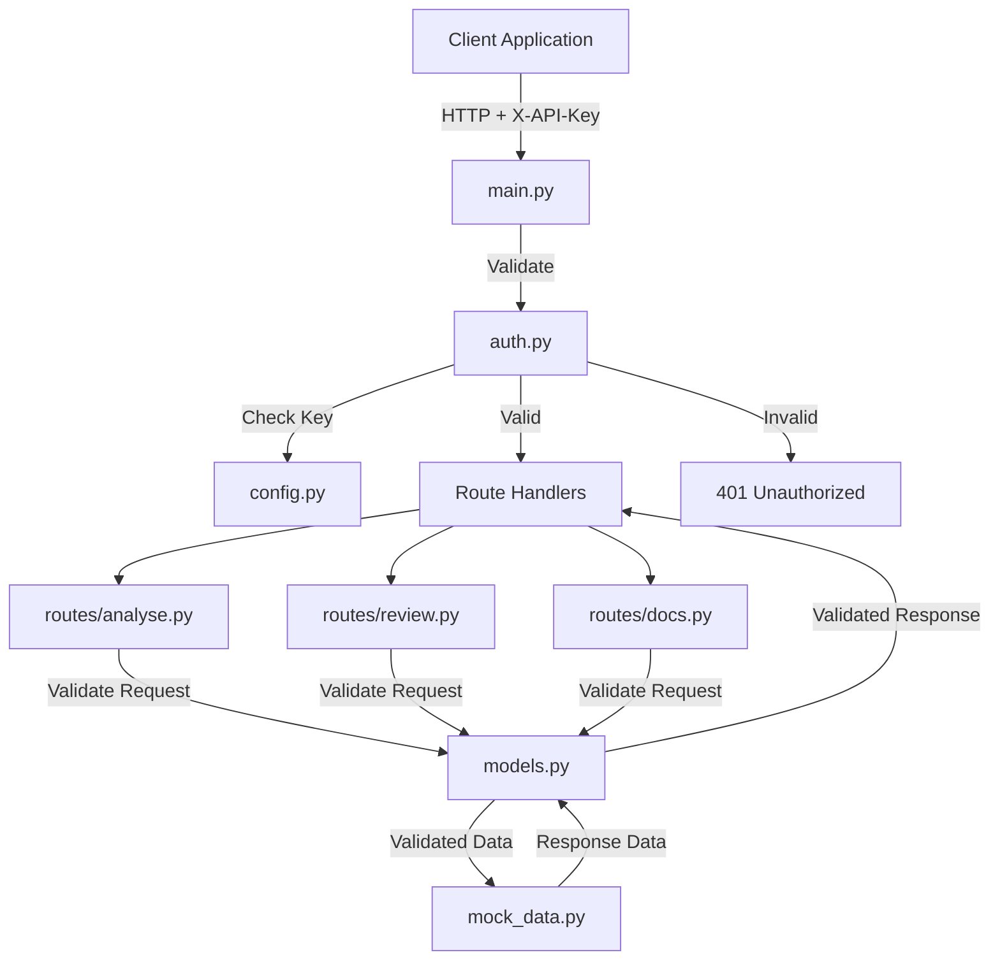
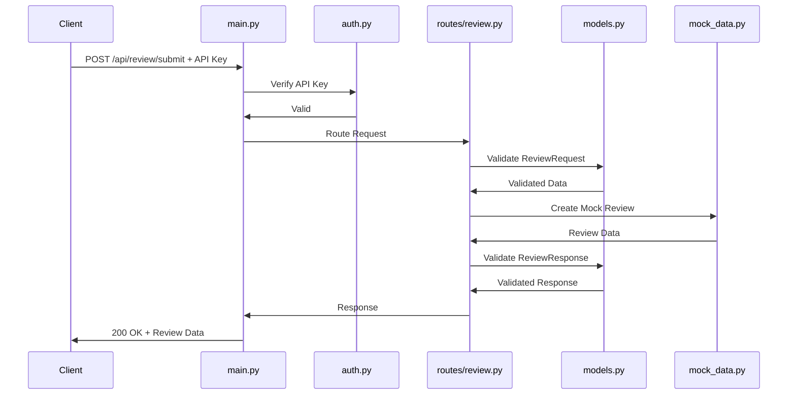

# DevAssist FastAPI Backend - Architecture Documentation

## Updated Project Structure

```
DevAssist/
├── main.py                 # FastAPI app entry point with middleware
├── config.py              # Configuration and environment management
├── auth.py                # API key authentication logic
├── models.py              # Pydantic schemas for validation
├── mock_data.py           # Mock data store for development
├── routes/
│   ├── __init__.py       # Routes package initialization
│   ├── analyse.py        # Code analysis endpoints
│   ├── review.py         # Code review endpoints
│   └── docs.py           # Documentation endpoints
├── requirements.txt       # Python dependencies
├── .env.example          # Environment variables template
└── README.md             # Project documentation
```

## Architecture Diagram



## Component Details

### 1. models.py - Pydantic Schemas

**Purpose:** Define request/response models for type safety and validation

**Schemas Include:**

#### Code Analysis Models
- `CodeSnippet` - Input code for analysis
  - `code: str` - The code to analyze
  - `language: str` - Programming language
  - `filename: Optional[str]` - File name
  
- `AnalysisResult` - Analysis output
  - `complexity_score: int` - Code complexity
  - `issues: List[Issue]` - Found issues
  - `metrics: CodeMetrics` - Code metrics
  
- `CodeMetrics` - Code quality metrics
  - `lines_of_code: int`
  - `cyclomatic_complexity: int`
  - `maintainability_index: float`

#### Code Review Models
- `ReviewRequest` - Submit code for review
  - `code: str` - Code to review
  - `language: str` - Programming language
  - `title: str` - Review title
  - `description: Optional[str]`
  
- `ReviewResponse` - Review details
  - `review_id: str` - Unique identifier
  - `status: str` - Review status
  - `comments: List[Comment]` - Review comments
  - `created_at: datetime`
  
- `Comment` - Review comment
  - `line_number: int` - Code line reference
  - `message: str` - Comment text
  - `severity: str` - Issue severity

#### Documentation Models
- `GuidelineResponse` - Coding guidelines
  - `category: str` - Guideline category
  - `rules: List[Rule]` - Specific rules
  
- `SearchRequest` - Documentation search
  - `query: str` - Search query
  - `category: Optional[str]` - Filter by category

### 2. main.py - Application Entry

**Responsibilities:**
- Initialize FastAPI app
- Configure CORS middleware
- Register authentication dependency
- Include route modules
- Setup exception handlers
- Configure OpenAPI docs

### 3. config.py - Configuration

**Settings:**
- `API_KEYS: List[str]` - Valid API keys
- `APP_NAME: str` - Application name
- `DEBUG: bool` - Debug mode
- `HOST: str` - Server host
- `PORT: int` - Server port
- `CORS_ORIGINS: List[str]` - Allowed origins

### 4. auth.py - Authentication

**Functions:**
- `verify_api_key(api_key: str)` - Validate API key
- `get_api_key(x_api_key: str = Header())` - Dependency for routes
- Custom exception for auth failures

### 5. mock_data.py - Data Store

**Data Collections:**
- `MOCK_REVIEWS` - Sample code reviews
- `MOCK_ANALYSIS_RESULTS` - Sample analysis data
- `MOCK_GUIDELINES` - Coding guidelines
- `MOCK_BEST_PRACTICES` - Best practices

**Helper Functions:**
- `get_review_by_id(review_id: str)`
- `get_all_reviews()`
- `create_mock_review(data: dict)`
- `get_analysis_result(code: str)`

### 6. Route Modules

#### routes/analyse.py
```
POST   /api/analyse/code        - Analyze code snippet
GET    /api/analyse/metrics     - Get code metrics
POST   /api/analyse/complexity  - Calculate complexity
```

#### routes/review.py
```
POST   /api/review/submit              - Submit code for review
GET    /api/review/{review_id}         - Get review details
GET    /api/review/list                - List all reviews
PUT    /api/review/{review_id}/comment - Add comment
```

#### routes/docs.py
```
GET    /api/docs/guidelines      - Get coding guidelines
GET    /api/docs/best-practices  - Get best practices
POST   /api/docs/search          - Search documentation
```

## Data Flow Example



## API Authentication

**Header Required:**
```
X-API-Key: your-api-key-here
```

**Response Codes:**
- `200` - Success
- `401` - Unauthorized (invalid/missing API key)
- `422` - Validation Error (invalid request body)
- `500` - Internal Server Error

## Dependencies

```
fastapi>=0.104.0
uvicorn[standard]>=0.24.0
pydantic>=2.5.0
pydantic-settings>=2.1.0
python-dotenv>=1.0.0
```

## Environment Variables

```env
API_KEYS=dev-key-123,prod-key-456
APP_NAME=DevAssist
DEBUG=true
HOST=0.0.0.0
PORT=8000
CORS_ORIGINS=http://localhost:3000,http://localhost:8080
```

## Error Handling Patterns

### Custom Exception Classes

```python
# In main.py or separate exceptions.py
class DevAssistException(Exception):
    """Base exception for DevAssist"""
    pass

class AuthenticationError(DevAssistException):
    """Raised when API key is invalid"""
    pass

class ResourceNotFoundError(DevAssistException):
    """Raised when requested resource doesn't exist"""
    pass

class ValidationError(DevAssistException):
    """Raised when data validation fails"""
    pass
```

### Global Exception Handlers

```python
# In main.py
from fastapi import Request, status
from fastapi.responses import JSONResponse

@app.exception_handler(AuthenticationError)
async def auth_exception_handler(request: Request, exc: AuthenticationError):
    return JSONResponse(
        status_code=status.HTTP_401_UNAUTHORIZED,
        content={
            "error": "Authentication failed",
            "message": str(exc),
            "type": "AuthenticationError"
        }
    )

@app.exception_handler(ResourceNotFoundError)
async def not_found_exception_handler(request: Request, exc: ResourceNotFoundError):
    return JSONResponse(
        status_code=status.HTTP_404_NOT_FOUND,
        content={
            "error": "Resource not found",
            "message": str(exc),
            "type": "ResourceNotFoundError"
        }
    )

@app.exception_handler(Exception)
async def general_exception_handler(request: Request, exc: Exception):
    return JSONResponse(
        status_code=status.HTTP_500_INTERNAL_SERVER_ERROR,
        content={
            "error": "Internal server error",
            "message": "An unexpected error occurred",
            "type": "InternalServerError"
        }
    )
```

### Error Response Model

```python
# In models.py
class ErrorResponse(BaseModel):
    error: str
    message: str
    type: str
    details: Optional[Dict[str, Any]] = None
```

### Route-Level Error Handling

```python
# Example in routes/review.py
from fastapi import HTTPException

@router.get("/review/{review_id}")
async def get_review(review_id: str):
    try:
        review = get_review_by_id(review_id)
        if not review:
            raise ResourceNotFoundError(f"Review {review_id} not found")
        return review
    except ResourceNotFoundError as e:
        raise HTTPException(
            status_code=404,
            detail=str(e)
        )
    except Exception as e:
        raise HTTPException(
            status_code=500,
            detail="Failed to retrieve review"
        )
```

### Validation Error Handling

FastAPI automatically handles Pydantic validation errors and returns 422 responses:

```json
{
  "detail": [
    {
      "loc": ["body", "code"],
      "msg": "field required",
      "type": "value_error.missing"
    }
  ]
}
```

### Error Response Examples

#### 401 Unauthorized
```json
{
  "error": "Authentication failed",
  "message": "Invalid or missing API key",
  "type": "AuthenticationError"
}
```

#### 404 Not Found
```json
{
  "error": "Resource not found",
  "message": "Review abc123 not found",
  "type": "ResourceNotFoundError"
}
```

#### 422 Validation Error
```json
{
  "detail": [
    {
      "loc": ["body", "language"],
      "msg": "value is not a valid enumeration member",
      "type": "type_error.enum"
    }
  ]
}
```

#### 500 Internal Server Error
```json
{
  "error": "Internal server error",
  "message": "An unexpected error occurred",
  "type": "InternalServerError"
}
```

## Running the Application

```bash
# Install dependencies
pip install -r requirements.txt

# Copy environment template
cp .env.example .env

# Edit .env with your API keys

# Run the server
uvicorn main:app --reload
```

## API Documentation

Once running, access:
- Swagger UI: http://localhost:8000/docs
- ReDoc: http://localhost:8000/redoc