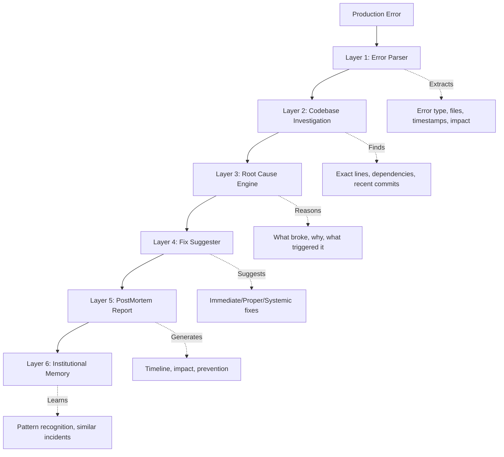

# 🚨 PostMortem AI - Strategic Implementation Plan

## Executive Summary

**PostMortem AI transforms the 3am production crisis from a 4-hour nightmare into a 20-minute fix.**

Your UI mockups reveal a sophisticated incident investigation system that goes far beyond basic error logging. This document outlines the complete strategy to build the killer feature that makes Bob premium and different.

---

## 🎯 The Core Problem We Solve

### The Developer's Nightmare

```
3am. Production is down.
50,000 users can't check out.
Slack is on fire.
Cryptic error log.
Senior engineer on vacation.
```

### Current Tools vs PostMortem AI

| Tool           | What They Give   | What We Give                       |
| -------------- | ---------------- | ---------------------------------- |
| Sentry/Datadog | Error logs       | **Root cause analysis**            |
| LogRocket      | Stack traces     | **Exact fix with reasoning**       |
| PagerDuty      | Alerts           | **Auto-generated incident report** |
| GitHub Copilot | Code suggestions | **3-tier fix strategy**            |

**The Difference:** We don't just show the error - we explain WHY it happened, WHERE the real problem is, and HOW to fix it at 3 levels.

---

## 💎 What Makes This Premium

### 1. The 6-Layer Intelligence Stack



### 2. The Unfair Advantage

**Bob has full codebase context** - this is what competitors don't have:

- Which commit last touched the error line?
- What changed in that commit?
- Who wrote it and what were they trying to do?
- What other functions depend on this?
- Is this an edge case nobody handled?

### 3. Senior Engineer Reasoning

Instead of: `"Error on line 47"`

Bob says:

```
The error originates at checkout.js:47 but the actual root cause
is in products.js:203. A recent update to the product fetching
logic made discount an optional field, but checkout.js assumes
it always exists. The change was introduced in commit a3f9c2 on
May 12th when the team added flash sale support.

The fix isn't in checkout.js — it's adding a null check in the
product schema validator.
```

---

## 🏗️ Architecture Design

### Phase 1: Production Error Input Flow

#### A. New Tab: "Production Error" 🆕

Add 4th tab to investigate page:

```
[Repository] [Code Snippet] [Upload File] [🆕 Production Error]
```

#### B. Input Interface

```typescript
interface ProductionErrorInput {
  // Primary input
  errorLog: string; // Stack trace, error message, logs

  // Optional context
  monitoringUrl?: string; // Link to Sentry/Datadog/etc
  environment?: string; // production/staging/dev
  timestamp?: Date; // When error occurred
  userImpact?: {
    affectedUsers: number;
    revenueImpact?: number;
    duration?: number; // in minutes
  };

  // Repository context (auto-detected or manual)
  repoUrl?: string;
  branch?: string;
}
```

#### C. UI Design (Based on Mockups)

```
┌─────────────────────────────────────────────────────────┐
│  NEW INVESTIGATION                                       │
│  ┌─────────────────────────────────────────────────┐   │
│  │ github.com/acme-corp/checkout-service           │   │
│  └─────────────────────────────────────────────────┘   │
│                                                          │
│  ┌─────────────────────────────────────────────────┐   │
│  │ TypeError: Cannot read property 'price' of      │   │
│  │ undefined                                        │   │
│  │     at calculateTotal (checkout.js:47)          │   │
│  │     at processOrder (orders.js:112)             │   │
│  │     at async handlePayment (payments.js:89)     │   │
│  │     at async POST /api/checkout (server.js:203) │   │
│  └─────────────────────────────────────────────────┘   │
│                                                          │
│  [🔍 Investigate →]                                     │
└─────────────────────────────────────────────────────────┘
```

---

### Phase 2: The Investigation Flow

#### Layer 1: Error Parser

**What it does:** Extracts meaningful information from raw error logs

```typescript
interface ParsedError {
  errorType: string; // TypeError, ReferenceError, etc
  errorMessage: string; // The actual error message
  stackTrace: StackFrame[]; // Parsed stack trace
  affectedFiles: string[]; // Files in the stack
  primaryFile: string; // Where error was thrown
  primaryLine: number; // Exact line number
  environment: string; // production/staging
  timestamp: Date;
  severity: "P0" | "P1" | "P2" | "P3";
  userImpact: {
    estimatedUsers: number;
    revenueImpact?: number;
    duration: number;
  };
}

interface StackFrame {
  function: string;
  file: string;
  line: number;
  column: number;
  context?: string; // Surrounding code if available
}
```

**UI Display:**

```
┌─────────────────────────────────────────────────────────┐
│  SEVERITY    USERS HIT    EST. IMPACT    MTTR           │
│  ┌────────┐  ┌────────┐  ┌──────────┐  ┌──────┐       │
│  │   P1   │  │ 12.4k  │  │  $47k    │  │ 18m  │       │
│  │Production│ │Last 25m│  │Revenue   │  │ avg  │       │
│  │  down  │  │        │  │  Loss    │  │      │       │
│  └────────┘  └────────┘  └──────────┘  └──────┘       │
└─────────────────────────────────────────────────────────┘
```

#### Layer 2: Codebase Investigation

**What it does:** Cross-references error against entire repository

```typescript
interface CodebaseInvestigation {
  // File analysis
  affectedFiles: FileAnalysis[];

  // Git history
  recentCommits: CommitAnalysis[];

  // Dependency chain
  dependencyGraph: DependencyNode[];

  // Similar patterns
  similarErrors: SimilarError[];
}

interface FileAnalysis {
  path: string;
  errorLine: number;
  errorColumn: number;
  codeContext: string; // 10 lines before/after
  functionName: string;
  lastModified: Date;
  lastModifiedBy: string;
  lastCommit: string;
}

interface CommitAnalysis {
  hash: string;
  author: string;
  date: Date;
  message: string;
  filesChanged: string[];
  relevanceScore: number; // How likely this caused the issue
  diff: string; // What changed
}

interface DependencyNode {
  file: string;
  function: string;
  calledBy: string[];
  calls: string[];
  depth: number;
}
```

**UI Display:**

```
┌─────────────────────────────────────────────────────────┐
│  🔍 BOB'S ROOT CAUSE ANALYSIS                    [live] │
│                                                          │
│  ● Parsed stack trace → 4 files                        │
│  ● Scanned repo context (2,847 files)                  │
│  ● Traced dependency chain                             │
│  ● Identified commit a3f9c2 (May 12)                   │
│  ⏳ Generating fix suggestions...                       │
└─────────────────────────────────────────────────────────┘
```

#### Layer 3: Root Cause Engine

**What it does:** Reasons through the problem like a senior engineer

```typescript
interface RootCauseAnalysis {
  // The diagnosis
  rootCause: {
    description: string; // Human-readable explanation
    actualLocation: {
      file: string;
      line: number;
      reason: string;
    };
    errorLocation: {
      // Where error manifested
      file: string;
      line: number;
    };
    triggeringEvent: string; // What caused this to happen now
    introducedIn: {
      commit: string;
      date: Date;
      author: string;
      prNumber?: string;
      feature: string; // What feature introduced this
    };
  };

  // The reasoning
  reasoning: {
    whatBroke: string;
    whyItBroke: string;
    whyNow: string;
    whatWasAssumed: string;
    whatActuallyHappened: string;
  };

  // Impact analysis
  impact: {
    affectedCodePaths: string[];
    potentialSideEffects: string[];
    riskLevel: "low" | "medium" | "high" | "critical";
  };
}
```

**UI Display:**

```
┌─────────────────────────────────────────────────────────┐
│  🎯 BOB'S ROOT CAUSE ANALYSIS                           │
│                                                          │
│  Error originates at checkout.js:47 but root cause is  │
│  in products.js:203. A recent update made discount an  │
│  optional field, but checkout assumes it always exists. │
│  Introduced in commit a3f9c2 (May 12) during flash     │
│  sale feature.                                          │
│                                                          │
│  ⚠️ checkout.js:47                                      │
│     Null ref - price undefined on product object        │
│                                                          │
│  ↓                                                       │
│                                                          │
│  🎯 products.js:203                                     │
│     Root cause - discount field made optional           │
└─────────────────────────────────────────────────────────┘
```

#### Layer 4: Fix Suggester (3-Tier Approach)

**What it does:** Provides immediate, proper, and systemic fixes

```typescript
interface FixSuggestions {
  immediate: Fix; // Stop the bleeding NOW
  proper: Fix; // Do this in next PR
  systemic: Fix; // Prevent this class of bug forever
}

interface Fix {
  tier: "immediate" | "proper" | "systemic";
  title: string;
  description: string;
  code?: string; // Actual code to apply
  file?: string; // Where to apply it
  line?: number;
  reasoning: string; // Why this fix works
  tradeoffs: string[]; // What to watch out for
  estimatedTime: string; // How long to implement
  confidence: number; // 0-100
  testSuggestions?: string[]; // Tests to add
}
```

**UI Display (Exactly as in Mockup):**

```
┌─────────────────────────────────────────────────────────┐
│  FIX SUGGESTIONS                            [3 ready]   │
│                                                          │
│  🔴 IMMEDIATE - STOP THE CRASH                          │
│  ┌─────────────────────────────────────────────────┐   │
│  │ const price = product?.price ?? 0;              │   │
│  └─────────────────────────────────────────────────┘   │
│                                                          │
│  🟡 PROPER FIX - NEXT PR                                │
│  ┌─────────────────────────────────────────────────┐   │
│  │ if (!product.price && product.price !== 0) {    │   │
│  │   throw new ValidationError(                    │   │
│  │     'Product price is required'                 │   │
│  │   );                                            │   │
│  │ }                                               │   │
│  └─────────────────────────────────────────────────┘   │
│                                                          │
│  🟢 SYSTEMIC - PREVENT CLASS OF BUG                     │
│  ┌─────────────────────────────────────────────────┐   │
│  │ Enable TS strict null checks on                 │   │
│  │ product interfaces →                            │   │
│  └─────────────────────────────────────────────────┘   │
└─────────────────────────────────────────────────────────┘
```

#### Layer 5: PostMortem Report Generator

**What it does:** Auto-generates professional incident report

```typescript
interface PostMortemReport {
  // Header
  incidentId: string;
  title: string;
  severity: "P0" | "P1" | "P2" | "P3";
  status: "investigating" | "resolved" | "monitoring";

  // Timeline
  timeline: TimelineEvent[];

  // Impact
  impact: {
    duration: number; // minutes
    usersAffected: number;
    revenueImpact?: number;
    servicesAffected: string[];
  };

  // Technical details
  rootCause: string;
  fixApplied: string;

  // Prevention
  prevention: {
    immediate: string[];
    shortTerm: string[];
    longTerm: string[];
  };

  // Metadata
  detectedAt: Date;
  resolvedAt?: Date;
  detectedBy: string;
  resolvedBy?: string;
}

interface TimelineEvent {
  timestamp: Date;
  event: string;
  actor?: string;
  details?: string;
}
```

**UI Display:**

```
┌─────────────────────────────────────────────────────────┐
│  INCIDENT REPORT — May 15, 2026 03:14 UTC              │
│                                                          │
│  SEVERITY: P1 — Complete checkout failure               │
│  DURATION: 23 minutes                                   │
│  USERS AFFECTED: ~12,400                                │
│  REVENUE IMPACT: ~$47,000 (estimated)                   │
│                                                          │
│  TIMELINE:                                              │
│  03:14 — First error alert triggered                    │
│  03:16 — On-call engineer engaged                       │
│  03:37 — Root cause identified via PostMortem AI        │
│  03:41 — Fix deployed, service restored                 │
│                                                          │
│  ROOT CAUSE:                                            │
│  Null reference in checkout.js:47 caused by unhandled   │
│  optional field introduced in flash sale feature        │
│  (commit a3f9c2)                                        │
│                                                          │
│  FIX APPLIED:                                           │
│  Added null coalescing in calculateTotal() +            │
│  schema validation update in products.js                │
│                                                          │
│  PREVENTION:                                            │
│  1. Add TypeScript strict null checks                   │
│  2. Add integration test for products with no discount  │
│  3. Add pre-deploy check for checkout flow              │
│                                                          │
│  [📥 Download Report] [📋 Copy to Clipboard]            │
└─────────────────────────────────────────────────────────┘
```

#### Layer 6: Institutional Memory

**What it does:** Learns from every incident to prevent future ones

```typescript
interface IncidentMemory {
  // The incident
  incidentId: string;
  errorPattern: string;
  rootCausePattern: string;
  fixPattern: string;

  // Learning
  tags: string[]; // 'null-check', 'optional-field', etc
  category: string; // 'type-error', 'logic-error', etc
  preventionStrategy: string;

  // Relationships
  similarIncidents: string[]; // IDs of similar past incidents
  relatedFiles: string[];
  relatedCommits: string[];

  // Metrics
  timeToDetect: number;
  timeToResolve: number;
  impactScore: number;

  // Search
  searchableText: string; // Full-text search
  embedding?: number[]; // Vector embedding for semantic search
}
```

**UI Feature:**

```
┌─────────────────────────────────────────────────────────┐
│  💡 SIMILAR INCIDENTS                                    │
│                                                          │
│  Bob found 2 similar incidents in your history:         │
│                                                          │
│  ● #INC-0042 (3 months ago)                             │
│    Null reference in payment processing                 │
│    Fixed by: Adding null checks                         │
│    Time saved: 2.5 hours                                │
│                                                          │
│  ● #INC-0089 (1 month ago)                              │
│    Optional field assumption in cart                    │
│    Fixed by: Schema validation                          │
│    Time saved: 1.8 hours                                │
│                                                          │
│  [View Pattern Analysis]                                │
└─────────────────────────────────────────────────────────┘
```

---

## 🎨 Enhanced UI/UX Specifications

### Color Coding System

```css
/* Severity levels */
--severity-p0: #ff0000; /* Critical - Red */
--severity-p1: #ff6b00; /* High - Orange */
--severity-p2: #ffb800; /* Medium - Yellow */
--severity-p3: #00b8ff; /* Low - Blue */

/* Fix tiers */
--fix-immediate: #ff4444; /* Red - urgent */
--fix-proper: #ffb800; /* Yellow - planned */
--fix-systemic: #00c853; /* Green - preventive */

/* Status indicators */
--status-investigating: #ffb800;
--status-resolved: #00c853;
--status-monitoring: #00b8ff;
```

### Animation & Interactions

1. **Live Investigation Trace**
   - Animated dots showing progress
   - Smooth transitions between steps
   - Pulse effect on active step

2. **Fix Suggestions**
   - Expandable cards with smooth animations
   - Copy-to-clipboard with visual feedback
   - Apply fix button with confirmation

3. **Timeline Visualization**
   - Vertical timeline with timestamps
   - Hover to see details
   - Click to jump to that moment

### Responsive Design

```
Desktop (1920px+):  3-column layout (trace | analysis | fixes)
Laptop (1280px):    2-column layout (trace+analysis | fixes)
Tablet (768px):     Single column, collapsible sections
Mobile (375px):     Stack all, swipe between sections
```

---

## 🔧 Technical Implementation

### Frontend Components

```typescript
// New components to create
components / postmortem / ErrorInput.tsx; // Production error input form
InvestigationTrace.tsx; // Live investigation progress
RootCauseDisplay.tsx; // Root cause visualization
FixSuggestions.tsx; // 3-tier fix display
PostMortemReport.tsx; // Generated report
SimilarIncidents.tsx; // Institutional memory
TimelineVisualization.tsx; // Incident timeline
```

### Backend Services

```typescript
// New API endpoints
POST /api/postmortem/analyze
  - Input: ProductionErrorInput
  - Output: AnalysisResult (streaming)

GET /api/postmortem/incidents
  - List all past incidents

GET /api/postmortem/incidents/:id
  - Get specific incident details

POST /api/postmortem/incidents/:id/similar
  - Find similar incidents

GET /api/postmortem/report/:id
  - Generate downloadable report
```

### Data Models

```typescript
// Database schema
tables:
  incidents:
    - id (uuid)
    - error_type (string)
    - error_message (text)
    - stack_trace (jsonb)
    - root_cause (text)
    - severity (enum)
    - status (enum)
    - created_at (timestamp)
    - resolved_at (timestamp)
    - user_impact (jsonb)

  fixes:
    - id (uuid)
    - incident_id (uuid)
    - tier (enum: immediate/proper/systemic)
    - code (text)
    - description (text)
    - applied (boolean)
    - applied_at (timestamp)

  incident_memory:
    - id (uuid)
    - incident_id (uuid)
    - pattern (text)
    - tags (text[])
    - embedding (vector)
    - related_incidents (uuid[])
```

---

## 📊 Success Metrics

### User Experience Metrics

- **Time to Root Cause:** < 2 minutes (vs 30+ minutes manual)
- **Fix Accuracy:** > 85% of suggested fixes work
- **Report Generation:** < 30 seconds (vs 2 hours manual)
- **User Satisfaction:** > 4.5/5 stars

### Business Metrics

- **Incident Resolution Time:** 70% reduction
- **Mean Time to Recovery (MTTR):** 60% improvement
- **Documentation Time:** 90% reduction
- **Repeat Incidents:** 40% reduction (via institutional memory)

### Technical Metrics

- **Error Parser Accuracy:** > 95%
- **Root Cause Detection:** > 80% accuracy
- **Similar Incident Matching:** > 75% relevance
- **API Response Time:** < 3 seconds for analysis start

---

## 🚀 Implementation Roadmap

### Phase 1: Foundation (Week 1-2)

- [ ] Create ProductionError tab UI
- [ ] Build error input form with validation
- [ ] Implement basic error parser
- [ ] Create investigation trace component
- [ ] Set up data models and API structure

### Phase 2: Core Intelligence (Week 3-4)

- [ ] Implement codebase investigation layer
- [ ] Build root cause analysis engine
- [ ] Create dependency graph analyzer
- [ ] Integrate with Git history
- [ ] Add commit analysis

### Phase 3: Fix Generation (Week 5-6)

- [ ] Build 3-tier fix suggestion system
- [ ] Implement code generation for fixes
- [ ] Add confidence scoring
- [ ] Create fix preview and apply functionality
- [ ] Add test suggestion generation

### Phase 4: Reporting (Week 7-8)

- [ ] Build PostMortem report generator
- [ ] Create timeline visualization
- [ ] Add impact calculation
- [ ] Implement report export (PDF, Markdown)
- [ ] Add sharing functionality

### Phase 5: Memory & Learning (Week 9-10)

- [ ] Build incident database
- [ ] Implement pattern recognition
- [ ] Add similar incident matching
- [ ] Create vector embeddings for semantic search
- [ ] Build prevention recommendation system

### Phase 6: Polish & Launch (Week 11-12)

- [ ] UI/UX refinements
- [ ] Performance optimization
- [ ] Add animations and transitions
- [ ] Write documentation
- [ ] Create demo video
- [ ] Launch beta

---

## 💡 Additional Premium Features

### 1. Slack/Teams Integration

```
When incident detected:
  → Auto-post to #incidents channel
  → Include severity, impact, and investigation link
  → Update thread as Bob investigates
  → Post final report when resolved
```

### 2. Monitoring Tool Integration

```
Connect to:
  - Sentry
  - Datadog
  - New Relic
  - LogRocket

Auto-trigger PostMortem analysis when:
  - Error rate spikes
  - New error pattern detected
  - Critical alert fired
```

### 3. CI/CD Integration

```
Pre-deployment checks:
  - Scan for patterns similar to past incidents
  - Flag risky changes
  - Suggest additional tests
  - Require review for high-risk areas
```

### 4. Team Analytics

```
Dashboard showing:
  - Most common error patterns
  - Fastest/slowest incident resolutions
  - Most impactful incidents
  - Prevention effectiveness
  - Team learning curve
```

---

## 🎯 Competitive Positioning

### vs Sentry

- **Sentry:** Shows you the error
- **PostMortem AI:** Tells you why it happened and how to fix it

### vs Datadog

- **Datadog:** Monitors and alerts
- **PostMortem AI:** Investigates and solves

### vs GitHub Copilot

- **Copilot:** Suggests code
- **PostMortem AI:** Understands your entire codebase context

### The Unique Value Prop

```
"From error to fix in 20 minutes, not 4 hours.
With a professional incident report ready to share."
```

---

## 📝 Next Steps

1. **Review this plan** - Does this match your vision?
2. **Prioritize features** - What's MVP vs nice-to-have?
3. **Choose tech stack** - What AI models, databases, etc?
4. **Set timeline** - Realistic delivery dates?
5. **Switch to Code mode** - Ready to start building?

---

## 🎬 Demo Script (For Investors/Users)

```
[Scene: 3am, developer gets paged]

"Production is down. 50,000 users affected.
You have no idea where to start.

[Open PostMortem AI]

Paste the error log. Hit investigate.

[Bob starts working]

In 90 seconds, Bob tells you:
- The error is in checkout.js line 47
- But the ROOT CAUSE is in products.js line 203
- It was introduced in commit a3f9c2 on May 12th
- During the flash sale feature
- Here's the immediate fix [shows code]
- Here's the proper fix [shows code]
- Here's how to prevent this forever [shows strategy]

[Apply the fix]

Service restored. 23 minutes total.

[Bob generates report]

Professional incident report ready to share with your team.
Timeline, root cause, fix, prevention - all documented.

That's PostMortem AI. Your senior engineer, always available."
```

---

## 🔥 Why This Will Win

1. **Solves a painful, expensive problem** - Production incidents cost companies millions
2. **Unique technical moat** - Full codebase context + AI reasoning
3. **Immediate ROI** - First incident pays for itself
4. **Network effects** - Institutional memory gets smarter over time
5. **Premium positioning** - This is enterprise-grade tooling
6. **Viral potential** - Developers will share their "Bob saved me at 3am" stories

---

**This is not just another dev tool. This is the difference between panic and confidence when production breaks.**

Ready to build it? 🚀
